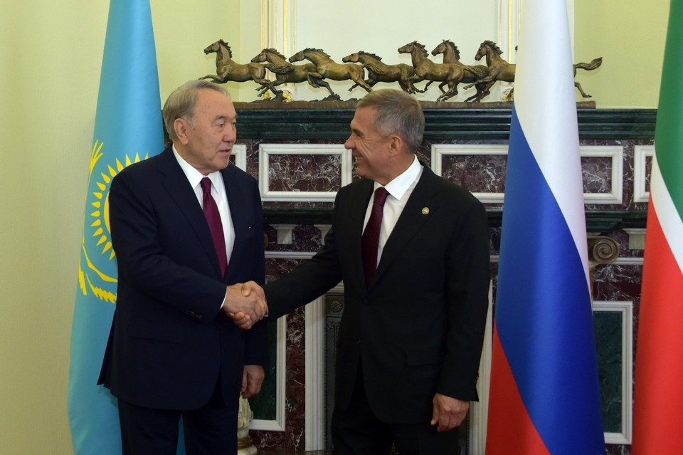

Республика Казахстан – давний стратегический партнер Республики Татарстан в рамках сотрудничества с Российской Федерацией. Первые президенты Казахстана и Татарстана всегда демонстрировали, что сложившиеся вековые связи между народами - залог стабильного развития дружеских и деловых связей. Ученые говорят о кровном родстве казахских и татарских элит средних веков. Татарстан бережно сохраняет теплые отношения с Казахстаном на протяжении многих десятилетий. В Казани именем первого президента Казахстана Нурсултана Назарбаева названа одна из центральных улиц. В нынешнем году Назарбаев отмечает 80-летие. На вопросы о том, какую роль он сыграл в укреплении сотрудничества с Татарстаном, ответил&nbsp;**Президент Республики Татарстан Рустам Минниханов**.

**- Вы возглавляете один из экономически успешных регионов России. Татарстан «нацелен» на выстраивание отношений с иностранными государствами. Какую нишу занимает «казахстанский сегмент» во внешнеполитических, внешнеэкономических и культурных связях Татарстана? Каковы основные направления сотрудничества? Какую роль в выстраивании этих связей сыграл Нурсултан Назарбаев?**

- Действительно, международное сотрудничество имеет особое значение для Республики Татарстан. Наша экономика тесно интегрирована в мировые хозяйственные связи: около половины промышленной продукции ориентировано на экспорт. Мы активно развиваем производственную кооперацию с зарубежными партнерами. В Татарстане созданы две особые экономические зоны: «Алабуга», промышленно-производственного типа, и «Иннополис» - со специализацией на высоких технологиях. У нас в республике работают 5 территорий особого социально-экономического развития - ТОСЭР, а также около 100 промышленных площадок.

Мы находимся в постоянной связи с татарскими общественными организациями, оказываем содействие в сохранении языка, культуры и традиций татарского народа. При этом самые многочисленные татарские общины – в странах ближнего зарубежья. Напомню, что за рубежом проживает около 1 миллиона татар.

Один из приоритетов в нашей работе - укрепление деловых и гуманитарных связей со странами СНГ в рамках единой российской внешней политики. И здесь Республика Казахстан – наш давний стратегический партнер.

И, конечно, один из первых визитов официальных татарстанских делегаций состоялся именно в Казахстан, в августе 1992 года делегацию во главе с первым президентом Республики Татарстан Минтимером Шариповичем Шаймиевым принял Нурсултан Абишевич Назарбаев. Первые президенты Казахстана и Татарстана своим примером всегда показывали нам, как создавать и бережно сохранять теплые дружеские отношения между народами на протяжении десятилетий.

Мы благодарны руководству наших государств – Президенту Российской Федерации Владимиру Владимировичу Путину и Президенту Республики Казахстан Касым-Жомарту Кемелевичу Токаеву за внимание и поддержку сотрудничества между Россией и Казахстаном на региональном уровне.

В 1996 году было подписано двустороннее соглашение о принципах торгово-экономического, научно-технического и культурного сотрудничества. Активно работают Генеральное консульство и торгпредство Республики Казахстан в Казани (с 2012 г.), в Нур-Султане многие годы (с 1997 г.) работает торговое представительство Татарстана. Действует Татарстано-Казахстанская рабочая группа по торгово-экономическому сотрудничеству. Вообще-то говоря, торговые отношения связывают нас с Казахстаном еще со времен Великого шелкового пути.

Нурсултан Назарбаев неоднократно посещал Татарстан (апрель 1996 года, июнь-июль 2004 года, август 2005 года, июнь 2018 года), и каждый его визит придавал новый импульс взаимовыгодному сотрудничеству.

К нам также часто приезжают официальные и деловые делегации Казахстана. В октябре 2018 года в Казани состоялось 20-е заседание Межправительственной комиссии по сотрудничеству между Российской Федерацией и Республикой Казахстан. В прошлом 2019 году Казань посетил с рабочим визитом Премьер-министр Республики Казахстан Аскар Мамин.

Я часто бываю в Казахстане - с 2010 года состоялось уже 16 официальных визитов. В августе 2010 года я впервые посетил Казахстан в статусе Президента Татарстана. Тогда на встрече с Нурсултаном Абишевичем мы обсуждали актуальные вопросы двустороннего сотрудничества.

По итогам 2019 года татарстано-казахстанский товарооборот составил 550 млн долларов США. По традиции мы поставляем в Казахстан продукцию машиностроения и нефтехимии, обмениваемся встречными поставками продукции сельского хозяйства и товаров народного потребления.

Наше совместное предприятие «КАМАЗ-Инжиниринг» является примером сотрудничества нового уровня. Завод в Кокшетау производит грузовые автомобили КАМАЗ не только для Казахстана, но и для других стран. Это предприятие стало полноправным членом большой семьи автозаводов КАМАЗа.

Да, наша взаимная торговля - это хорошо, но для более мощного индустриального развития мы должны думать о совместном создании продукции для внешних рынков. В Татарстане и в Казахстане много конкурентоспособных промышленных предприятий, открытых для сотрудничества в сфере новых технологий производства. Это – перспективное направление совместной работы.

Татарстан участвует в крупных транспортно-логистических проектах Евразийского экономического союза, что напрямую связано с инициативами Нурсултана Абишевича Назарбаева и позицией президента Российской Федерации Владимира Владимировича Путина по наращиванию и реализации международного транзитного потенциала России и Казахстана.

И, конечно, у нас огромный пласт гуманитарного сотрудничества, базирующегося на духовно-культурной общности татарского и казахского народов, исторически сложившихся связях в области культуры, науки и образования.

В татарстанских вузах обучается около 1700 студентов из Казахстана. Новые знания должны принести пользу их родине, лучше всего, если это будут совместные проекты. Десятки казахстанских студентов (около 60 человек) прошли жесткий отбор и учатся сегодня в Университете Иннополис. Их сотрудничество с коллегами из Татарстана и всего мира закладывается уже сейчас, на студенческой скамье.

Более 16 тысяч граждан Казахстана живут и работают в Татарстане. В Казани действует Национально-культурная автономия казахов Татарстана. В Республике Казахстан проживает 205 тысяч татар, которые трудятся на благо этого братского для нас государства.

Исследователи Казахстана, России и Татарстана продолжают изучать общие страницы истории. Они охватывают и древние времена, и наши дни. Не случайно первый президент Казахстана Нурсултан Назарбаев, выступая 2018 году с лекцией в Казанском университете, отметил кровное родство казахской и татарской элиты средних веков.

С уверенностью могу сказать: сложившиеся веками связи между нашими народами - залог стабильного развития дружеских и деловых связей.

**- В качестве главы региона вы принимали участие в международных форумах с участием Назарбаева, например, в Астанинском форуме исламской экономики. Как воспринимают Назарбаева на международной арене?**

- Нурсултан Абишевич пользуется непререкаемым авторитетом во многих странах - и на Ближнем Востоке, и на Западе, и, конечно же, в России. Под его руководством Казахстан смог сохранить мир и преумножить благосостояние своего народа. Сегодня в Казахстане работают международные инвесторы и мировые компании, все они выражают доверие действующей власти республики и особое уважение к первому президенту Казахстана.

Многие годы совместно с Российской Федерацией Нурсултан Назарбаев активно участвует в построении многополярного мира. Он продвигает общие интересы всей Евразии, всячески поддерживая интеграцию этого огромного пространства, в котором все мы живем. Его последовательная позитивная деятельность вызывает большое уважение в мире.

Нам еще предстоит оценить инициативу и огромную роль Нурсултана Абишевича в новейшей истории. Но уже сегодня есть понимание, что это значит для будущего наших народов, для геополитического, экономического и культурного развития евразийского пространства.

На практике это объединение создает условия для эффективного развития наших экономик, предоставляет возможность выйти на качественно новый уровень взаимодействия.

Значительный вклад Нурсултана Назарбаева в развитие идей Евразийства отмечен присвоением ему звания почетного доктора Казанского федерального университета.

**- Не так давно вы приняли участие в чествовании казахского поэта и мыслителя Абая в рамках флэш-моба #Abai175, прочитав стихотворение поэта на казахском языке «Я с удовольствием принимаю эстафету от своего друга – акима Восточно-Казахстанской области Даниала Кенжетаевича Ахметова и передаю ее татарской диаспоре, проживающей в Казахстане», - сказали вы. С какими акиматами Казахстана Татарстан «дружит регионами», в чем заключается это сотрудничество? Кстати, Казань и Нур-Султан являются городами-побратимами, в каких сферах взаимодействуют столицы?**

- Наша республика активно выстраивает сеть межрегиональных отношений по всему миру. Это важное и перспективное направление пользуется поддержкой на государственном уровне. Мы налаживаем прямые контакты производителей, обмениваемся промышленными и управленческими технологиями, внимательно изучаем опыт наших коллег. Всегда нужно учиться друг у друга.

Казахстан – это страна с огромным потенциалом. Нурсултан Абишевич Назарбаев заложил стремление к инновациям, динамичному развитию. Я часто бываю в Казахстане и вижу многие позитивные перемены. Поэтому мы одновременно выстраиваем отношения с молодой столицей Казахстана – городом Нур-Султан, и с деловым центром страны - Алматы. Активно работаем и с Шымкентом на юге Казахстана, Восточно-Казахстанской, Западно-Казахстанской, Актюбинской, Кызылординской, Северно-Казахстанской и другими областями. С четырьмя акиматами у нас подписаны межрегиональные соглашения о сотрудничестве.

Мы часто принимаем делегации акиматов Казахстана, обмениваемся опытом в части привлечения инвесторов, работы государственных органов власти.

Побратимами Казани являются и Нур-Султан, и Алматы. У больших городов есть общие проблемы, которые сегодня решаются сообща, среди них – работа общественного транспорта, развитие газомоторного и электротранспорта, вывоз и утилизация отходов, управление дорожным движением. Наши татарстанские ели каждый год укрепляют «зеленый пояс» столицы Казахстана, деревья нашего крупнейшего питомника также планируется поставить для озеленения Алматы. Интересуются в Казахстане и технологиями «умного города», над которыми работают резиденты ОЭЗ «Иннополис».

**- В Казахстане проживает 200 тыс. татар. Как ваши соплеменники оценивают национальную политику государства, основы которой были заложены во время правления первого президента?**

- Татары играют активную роль в жизни современного Казахстана. Нурсултан Назарбаев говорит: «Это наши татары», подчеркивая, что татарский народ является неотъемлемой частью многонационального народа Казахстана. Лучше всего, конечно, спросить у самих татар Казахстана, но, по моим личным наблюдениям, им там нравится. По инициативе Назарбаева была создана Ассамблея народа Казахстана. Аналогичные подходы реализуются и у нас, где сегодня на схожих принципах работает Ассамблея народов Татарстана.

Татары, живущие в Казахстане, заметны в общественной жизни, на производстве, в науке и культуре. Для нашего народа характерны трудолюбие и активность, доброжелательность и открытость, стремление к новым знаниям.

Как известно, в некоторых регионах и бывших союзных республиках СССР татары поселились давно, еще до советской власти. Многие приехали в годы социализма, участвовали в создании важных объектов индустрии, показали себя хорошими специалистами промышленности, аграрного комплекса, деятелями науки, культуры и просвещения. Много татар было среди участников освоения целины. Они переехали из Поволжья, Урала, Сибири и успешно адаптировались к условиям Казахстана.

Мы гордимся татарами Казахстана. Примечательно, что народный артист и лауреат Государственной премии Казахской ССР Латиф Хамиди – один из авторов музыки гимна Казахстана, создатель ряда прославленных казахских опер. Его именем названа улица в Алматы, музыкальная школа №1 в городе Семей.

В год 75-летия Победы над фашизмом мы вспоминаем тех, кто шел навстречу смерти в боях, кто своим трудом в тылу приближал нашу общую победу. Среди 10 героев, казненных вместе с Мусой Джалилем, были двое уроженцев Казахстана – Гайнан Курмашев из Актюбинской области и Ахат Атнашев, родившийся в Петропавловске. Такие герои – наша гордость. Можно также вспомнить родившихся в Казахстане писателя Ибрагима Салахова, поэта Нури Арсланова – лауреатов Государственной премии им. Габдуллы Тукая.

Город Уральск, где вырос и получил признание как поэт – классик татарской литературы Габдулла Тукай, дал татарской культуре будущего родоначальника татарской симфонической музыки, ректора Казанской консерватории Назиба Жиганова. И еще много фактов и имен, которые вписаны в историю Казахстана и татарского народа.

Наши земляки остаются жить в Казахстане, потому что считают его своим домом. В то же время татары поддерживают связи с исторической родиной, базовыми центрами национальной культуры и образования. В этом году мы отмечаем 100-летие Татарской АССР. Татары связывают Казахстан и Татарстан, тем самым содействуя укреплению дружбы и сотрудничества с Российской Федерацией в целом.

**- Вы неоднократно встречались с Нурсултаном Назарбаевым, обсуждали вопросы как рабочего, так и стратегического характера. Какие качества Назарбаева как лидера государства, как международного политика и просто как человека вы бы выделили?**

- Мудрость, стратегическое видение, умение ставить цели, исходя из интересов государства и общества, и вести страну к их достижению в партнерстве с соседями по Евразийскому пространству. Все это свойственно большим политикам.

Отмечу особый интерес Нурсултана Абишевича к передовому опыту, постоянное стремление к новым знаниям, к движению вперед – считаю, что этому мы должны учиться у казахстанского лидера.

И, конечно, надо брать пример с Нурсултана Назарбаева как с патриота своей страны, последовательно и уверенно отстаивающего ее интересы.

Россия и Казахстан – ближайшие соседи и исторические партнеры в своей общей судьбе. Взаимопонимание, установившееся между лидерами наших государств, является залогом нашего стабильного развития и возможностью для совместного ответа на любые новые вызовы.
