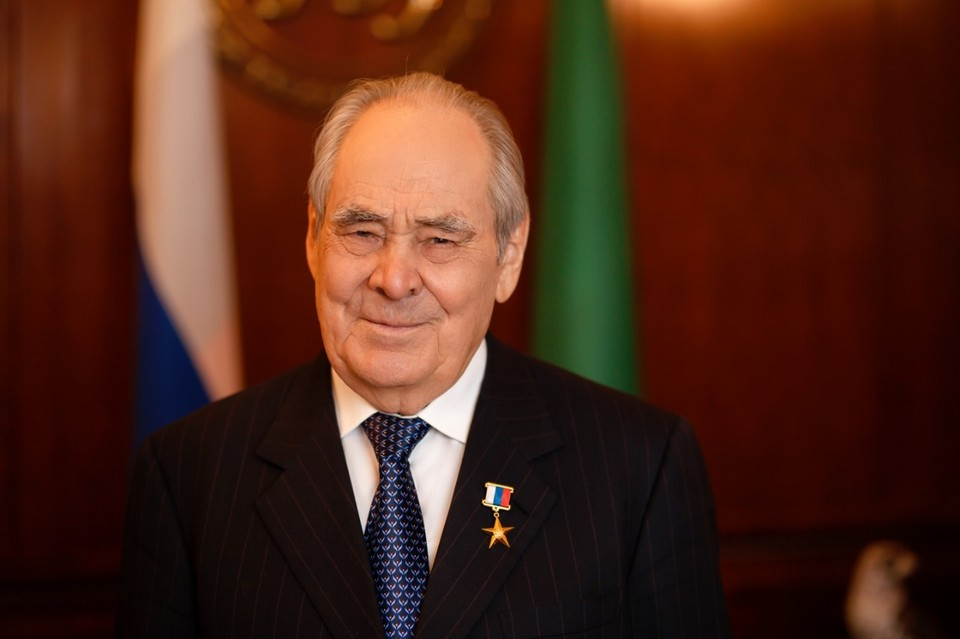

С первым президентом Казахстана Нурсултаном Назарбаевым у нас схожий жизненный путь, мы – дети своего времени и одной большой страны СССР, мы оба оказались в центре судьбоносных исторических событий перестроечных лет. Наша встреча, видимо, была неизбежна, потому что между Татарстаном и Казахстаном во все времена были не только дружеские, но и братские отношения.

Уже с середины ХVIII века татары стали массово переселяться на казахские земли, сначала в Уральск, Семипалатинск, Петропавловск, а их потомки в течение всего XIX века следовали дальше, вглубь казахской степи: в Кокчетав, Акмолинск, Павлодар, Атбасар и Верный (ныне Алматы). Это было временем переселенцев-просветителей: многие татары приезжали работать учителями в казахских школах. Территорию сегодняшнего Казахстана активно осваивал татарский капитал. После революции татары участвовали в государственном и культурном строительстве молодой казахской республики, например, именно татары познакомили Казахстан с театральным искусством.

После Великой Отечественной войны татары приезжали работать на шахты Караганды и Усть-Каменогорска, позже - осваивали целину.

**«Первый визит я совершил именно в Казахстан»**

Интерес татар к Казахстану объясняется благожелательным отношением коренного населения, единой верой, близостью языков, социальных и национальных чаяний. И, конечно же, широтой души тюркских народов, которая и сегодня привлекает татар в Казахстан, а казахов в Татарстан. Сегодня в обеих республиках существуют достаточно солидные диаспоры, которые поддерживаются руководством Татарстана и Казахстана. Например, в городе Уральск, где жил и творил наш великий поэт Габдулла Тукай, установлен его бюст в одноименном сквере и создан народный дом-музей поэта.

Должен подчеркнуть, что после обретения Казахстаном независимости не было даже намёка на какие-либо изменения в наших отношениях. Нам с Нурсултаном Назарбаевым выпала честь укреплять давние дружеские отношения на новом историческом витке, продолжать развивать многостороннее сотрудничество между нашими республиками. В самые сложные для Татарстана политические времена Назарбаев проявлял понимание и оказывал нам авторитетную поддержку. В 1992 году свой первый визит в качестве президента Татарстана (появление которого в 1991 году в политическом пространстве России воспринималось неоднозначно) я совершил именно в Казахстан, где был принят главой государства с почестями, соответствующими самому высокому рангу гостей.

Мне запомнилась поездка в Казахстан в 1995 году на празднование 150-летнего юбилея выдающегося акына Востока, известного поэта-мыслителя Абая Кунанбаева. В 1998 году мы были на международной презентации новой столицы Казахстана – Астаны. Я считаю, что перенос столицы суверенного государства Казахстан в Астану было далеко идущим стратегическим видением Нурсултана Назарбаева. Было много аргументов в пользу этого важнейшего для страны решения, но основной из них, с моей точки зрения, это право нового государства начать свою историю с чистого листа, с новой столицей. Также важно и то, что перенос столицы в город, находящийся в центре республики, сделал стабильной и бесспорной территориальную целостность Казахстана.

Город достойно представляет страну, символизируя новую жизнь Казахстана, который добился наибольших успехов по сравнению с большинством постсоветских государств. На карте мира появилось новая страна, набирающая силу и авторитет.

**«Достиг больших высот, не отрываясь от корней»**

Мы высоко ценим вклад Казахстана в сохранение и обогащение нашей общей тюркской культуры и развитие тюркского мира. В 2004 году Нурсултан Назарбаев выступил на Международной научной конференции «Идеи евразийства в научном наследии Л.Н. Гумилёва» в Казани, посвящённой памяти выдающегося учёного-тюрколога. Он сообщил, что принял решение присвоить новому Евразийскому университету в столице Казахстана имя основоположника евразийства Льва Николаевича Гумилёва, который, «будучи русским человеком, всю свою жизнь и всё своё творчество посвятил истории тюркских народов и культур». Сегодня этот университет - единственный в мире ВУЗ, носящий имя Гумилёва.

А мы в 2005 году к 1000-летию нашей столицы в центре города поставили памятник Льву Гумилёву с его словами: «Я, русский человек, всю жизнь защищаю татар от клеветы». Казахстан и по сей день активно продвигает идеи евразийства. И не случайно Договор об учреждении Евразийского экономического сообщества (ЕврАзЭС) был подписан именно в столице Республики Казахстан.

Как человек, имевший возможность наблюдать с близкого расстояния за развитием молодого государства и политическим становлением его бесспорного лидера, скажу, что Нурсултан Абишевич Назарбаев – человек, умудренный огромным жизненным опытом. Знание жизни, знание людей – это бесценное качество для руководителя любого уровня. Назарбаев – «человек от земли», который благодаря природному таланту, уму и стараниям прошёл путь от простого деревенского мальчика до президента страны, образно говоря: достиг больших высот, не отрываясь от своих корней. Смело отвечая на современные вызовы, меняя к лучшему мир вокруг себя, он остаётся неизменным в самом главном - в преданности своему народу. Поэтому он для нас, прежде всего, достойный сын казахского народа, который во многом следует народной житейской мудрости. Думаю, что именно поэтому Назарбаев выбрал единственно верный путь для Казахстана - братские отношения с ближайшим соседом Российской Федерацией. Обе страны сильны этой дружбой.

Братские, сердечные отношения

Решение Нурсултана Назарбаева оставить пост президента я воспринял с восхищением. Это поступок сильного человека, создавшего признанное за короткий период времени всем миром государство. Он - счастливый человек, излучающий свет. Мы видим, что заданный им вектор развития страны сохраняется в деятельности его соратника и преемника, нового президента Казахстана. Мы рады, что Касым-Жомарт Токаев и президент нашей республики Рустам Минниханов находят общий язык, что наши республики развивают успешное партнерство в рамках сотрудничества между Российской Федерацией и Республикой Казахстан.

Я благодарен судьбе за то, что мне посчастливилось в течение многих лет работать и общаться с Нурсултаном Абишевичем Назарбаевым. В нашем общении есть особая душевность, это - братские, сердечные отношения. Мы встречались сравнительно недавно, летом 2018 года, побеседовали, как говорится, от души, и не только о днях минувших, но и о том, что волнует нас сегодня, в том числе и о сохранении культурного наследия, чем я занимаюсь в настоящее время.

Лично от себя и от имени всех татарстанцев я от всей души поздравляю Нурсултана Назарбаева с 80-летним юбилеем, желаю здоровья и благополучия. Скажу по своему опыту: это замечательно, когда сам присутствуешь на своём 80-летии.

Юбилеегыз котлы булсын, кадерле Нурсолтан дустыбыз!

Сезге зор ден-саулык, өлкен табыс телимен, қомбатты Нурсолтан Әбиш улы!

*Тирән ихтирам белән, ихлас күңелдән - Минтимер.*

*(тат. С глубоким уважением, от всей души – Минтимер)*
