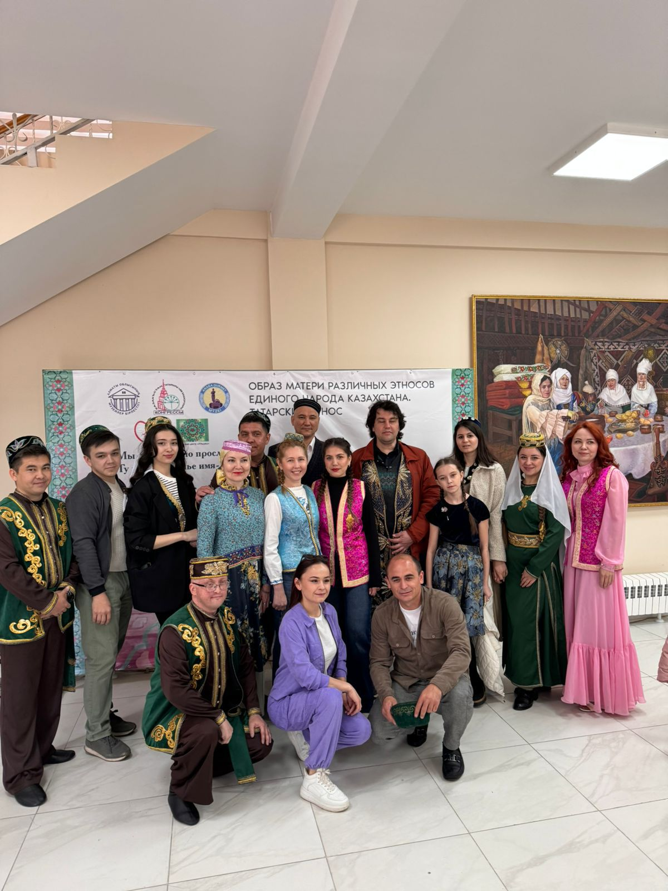
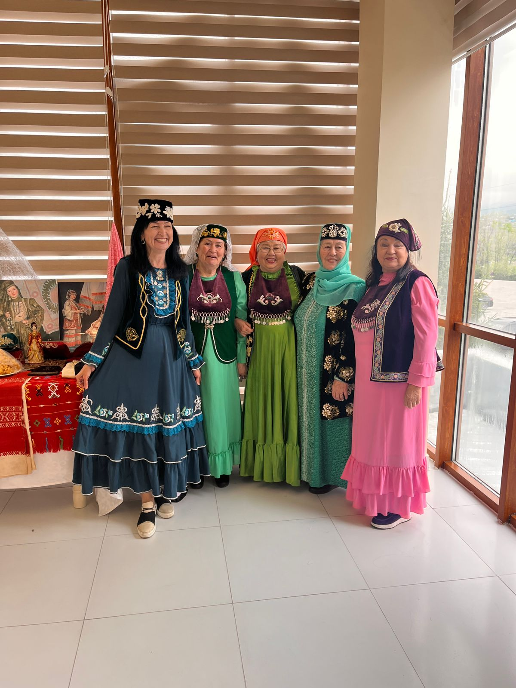
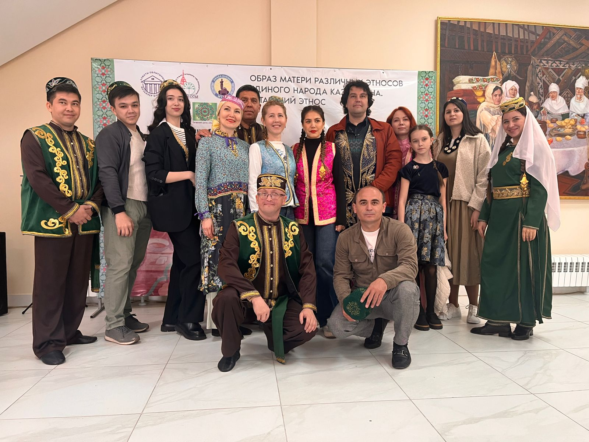
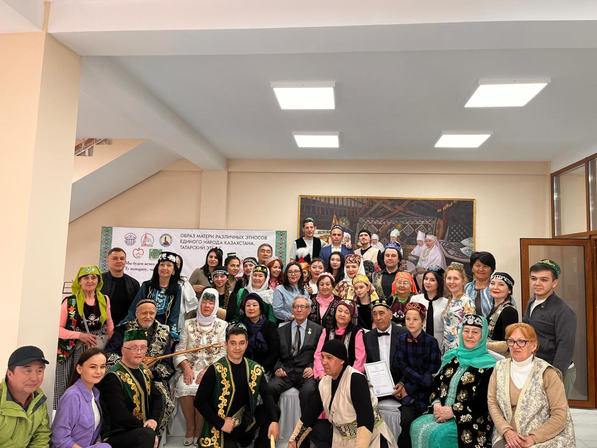
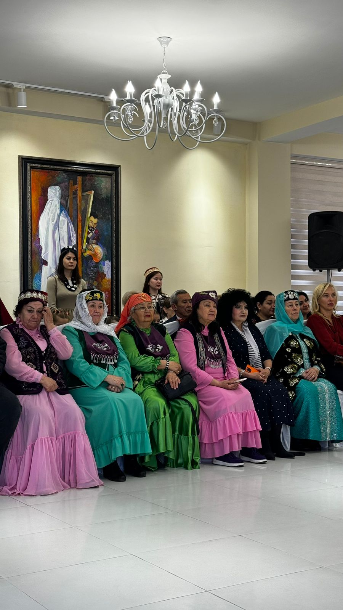

В программе данного мероприятия проводился «круглый стол» с участием: Помощника представителя Республики Татарстан в Республике Казахстан - Акижановой А.Ж., руководителя совета татарских и башкирских женщин «Ак Калфак» при РОО «Казахстанских Конгресс татар и башкир», председатель ОО «Татарский образовательный Культурный центр Дуслык г.Астаны»- Назимутдиновой Я.А., доктора педологических наук, профессор, академик международных академий, член координационного совета татарских ученых при АН РТ, заслуженный учитель РТ, почетный работник образования РК, отличник образования Республики Узбекистан, почетный председатель татаро-башкирского культурного центра Алматинской области - Хайруллин Г.Т. и многие другие.

Молодежь нашего центра выступила с различными номерами: ансамбль «Сарман» исполнил знаменитые музыкальные произведения, ансамбль «Идел» выступил с танцевальными номерами, от нашего младшего поколения выступали: Бахрамкызы Х., и Бахрамулы А.,солировали: Тенишева А., Насретдинова В., и Ходякина В., а так же активисты молодежного крыла подготовили прекрасные номера.

