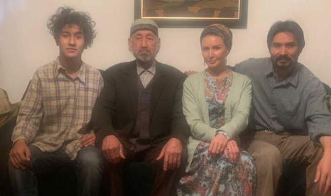

В Казахстане завершились съемки казахско-татарстанского фильма, в основу сценария которого легла повесть Галимджана Ибрагимова «Алмачуар», сообщает ГБУК «Татаркино».\
\
«Көкбозат» — рабочее название фильма, сценарий писал Бекболат Шекеров (Казахстан), а режиссерское кресло заняла Юлия Захарова (Татарстан). Съемки начались 15 сентября. Несмотря на сложности из-за пандемии коронавируса из Татарстана смогли прибыть режиссер и исполнительница одной из главных ролей в фильме — заслуженная артистка РТ Алсу Абульханова.

«Впечатления от съемок самые лучшие, потому что это возможность сняться в полнометражном фильме и прикоснуться к классике. Над картиной работает профессиональная команда. Со мной работали актеры и каскадеры, которые снимались в Голливуде», — рассказала Алсу Абульханова.\
\
По ее словам, хотя лента и рассчитана на современного зрителя, авторы стремятся отразить образ исторической реальности.\
\
Съемки продолжатся в Татарстане весной 2021 года при участии татарстанских актеров. Авторы постараются отразить весь дух и атмосферу национального праздника Сабантуй.&nbsp; Премьера фильма запланирована на осень 2021 года.
